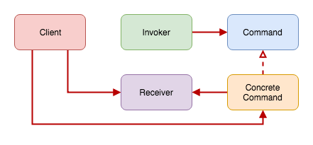
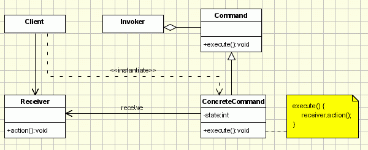
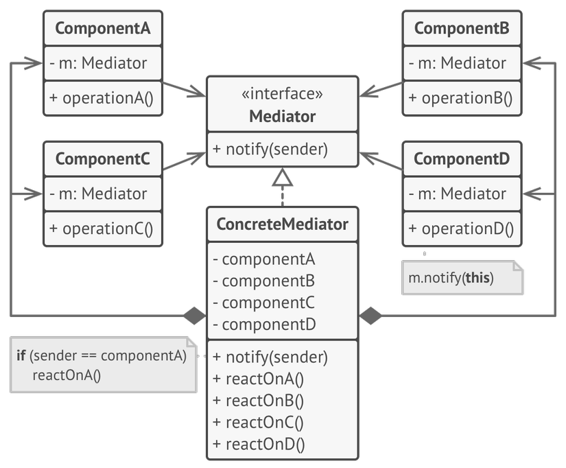

# III. Behavioral
## 1. Chain of Responsibility
> Cho phép chúng ta xử lý sự kiện bằng một hoặc nhiều Handler

Chain of Responsibility Pattern hoạt động dựa vào việc chuyển đổi **đối tượng tiếp nhận event** thành các **đối tượng độc lập** là các **handler**. Các handler sẽ được link với nhau thành một chuỗi các handler liên tiếp nhau. Khi một request (hoặc event) được gửi tới thì request đó sẽ được chuyển đi liên tiếp trong chuỗi handler cho tới khi gặp một handler có thể xử lý request đó. Mỗi handler đều có quyền quyết định rằng nó sẽ xử lý Request hoặc chuyển tiếp Request đó sang handler tiếp theo.

Chain of Responsibility tách nhỏ một request của người gửi, bằng việc tạo ra nhiều object để handle request đó. Giả sử bạn có 1 một request cần xử lý với nhiều logic. Nếu sử dung *if..else* quá nhiều thì sẽ quá phức tạp và khó refactor sau này. Vậy nên Chain of responsibility Pattern tạo ra 1 chuổi các handle. Mỗi handle xử lý một logic khác nhau và với một điệu kiện cụ thể nào đó. Nói cụ thể hơn thì Chain of responsibility dùng để tránh sự liên kết trực tiếp giữa đối tượng gửi request và đối tượng nhận request khi request đó có thể được xử lý bởi hơn 1 đối tượng.

### 1.1. Chain of Responsibility được sử dụng khi nào?
- Có nhiều hơn 1 đối tượng có thể xử lý request đó, nhưng đối tượng cụ thể nào thực hiện request đó lại phụ thuộc vào ngữ cảnh
- Khi có nhiều cách thức để xử lý cho cùng một yêu cầu được gửi tới
- Khi không muốn xác định rõ ràng cách thức xử lý một sự kiện được gửi tới
- Khi muốn đưa ra yêu cầu cho một trong nhiều đối tượng mà không chỉ định rõ ràng tượng nào sẽ nhận và xử lý yêu cầu
- Tập các đối tượng xử lí là tập các đối tượng độc lập và có khả năng biến đổi

### 1.2. Cấu trúc


Các thành phần tham gia vào Chain of Responsibility Pattern:
- **Client**: Nơi tạo ra các đối tượng handler và sử dụng chúng
- **Handler**: Interface tạo xương sống cho các handler.
- **BaseHandler**: (Tùy chọn) Nơi nhận request đầu tiên (handler đầu tiên). Bạn có thể không cần class này và có thể chỉ định một handler khác nhận request đầu tiên
- **ConcreteHandlers**: Các next handler

### 1.3. Thực hành
- Khai báo xương sống Handler
```js
interface Handler {
    setNext(handler: Handler): void;
    handle(request: Request): any;
}
```
- Tạo BaseHandler triển khai từ Handler (là nơi nhận request đầu tiên)
```js
class BaseHandler implements Handler {
    protected next?: Handler;
    init(next?: Handler) {
        this.next = next
    }
    setNext(handler?: Handler) : void {
        this.next = handler
    }
    handle(request: Request) : any {
        if(this.next!=null)
            return this.next.handle(request);
    }
}
```
- Tạo các cấu trúc cho các handler phía sau
```js
class ConcreteHandler extends BaseHandler {
    protected next?: Handler;
    init(next?: Handler) {
        this.next = next
    }
    setNext(handler?: Handler) : void {
        this.next = handler
    }
    handle(request: Request) : any {
        if(this.canHandle(request)) {
            // Code here
        } else {
            if(this.next!=null)
                return this.next.handle(request);
        }
    }
    canHandle(request: any) : boolean {
        // return True or False
    }
}
```
- Client tạo và sử dụng các handler
```js
class Client {
    sendRequest() {
        let thirdHandler = new ConcreteHandler(null);
        let secondHandler = new ConcreteHandler(thirdHandler);
        let firstHandler = new ConcreteHandler(secondHandler);
        let request = new Request();
        firstHandler.handle(request);
    }
}
```

## 2. Command
> Command Pattern (còn gọi là Action Pattern hoặc Transaction Pattern) tạo ra một đối tượng có thể triển khai một phương thức xác định nào đó từ một đối tượng đầu vào khác mà không cần biết đối tượng đầu vào khác có tính chất gì

### 2.1. Vấn đề
Bạn đang code một website bán hàng. Hàng tuần website sẽ gửi tin nhắn gồm thông tin những sản phẩm bán chạy nhất trong tuần này thông qua email hoặc SMS. Việc thông báo qua email hay SMS là do người dùng setting, đã chọn thông báo qua email thì không được chọn thông báo qua SMS và ngược lại. Câu hỏi đặt ra ở đây là làm sao xây dựng một đối tượng có thể gửi tin nhắn đầu vào thông qua 2 channels khác nhau (email channel và SMS channel) tùy theo setting của người dùng? 2 channel này cách thức hoạt động logic khác nhau.

Tưởng tượng bạn đang xây dựng SlickUI (là một framework GUI). Bạn đang bận rộn tạo ra những button đẹp, những dialogs tuyệt vời và những icon bắt mắt. Nhưng mỗi lần bạn kết thúc công việc tạo ra framework giao diện bắt mắt, bạn lại phải đối mặt với một vấn đề : "Làm thế nào bạn dùng giao diện đó để làm vài thứ có ích khác". Bạn hy vọng SlickUI sẽ phổ biến và được sử dụng bởi hàng nghìn lập trình viên trên thế giới, những người sẽ tạo ra hàng triệu instances của SlickButton. Một giải pháp cho vấn đề này rất phổ biến đó là *inheritance*. Bạn có thể yêu cầu người phát triển tạo một subclass cho mỗi loại button khác nhau. Nhưng thật không may, vì một ứng dụng GUI phức tạp sẽ có khoảng 10 với hàng trăm buttons, và như thế chúng ta phải có 10 tới hàng trăm subclass của SlickButton ư ? Hơn nữa, còn có những loại element GUI khác, như menu items, radio button. Bạn có thể hoặc muốn các nhà phát triển mã nguồn của mình phải làm những việc như thế không? Nếu không thì phải làm thế nào mới tốt nhất?

### 2.2. Giải quyết
Phương án cho vấn đề này là đóng gói ý tưởng, những action cần làm khi button được ấn hoặc menu item được chọn. Tức là gom code xử lý việc ấn button hoặc chọn menu trong object riêng. Những action này chính là những commands của Command Pattern.

### 2.3. Khi nào nên sử dụng Command Pattern?
- Khi cần tham số hóa các đối tượng theo một hành động
- Khi cần tạo và thực thi các yêu cầu vào các thời điểm khác nhau
- Khi cần hỗ trợ tính năng undo, log , callback hoặc transaction

### 2.4. Cấu trúc




Các thành phần tham gia vào Command Pattern:
- **Command**: Interface chứa một phương thức trừu tượng thực thi (execute) một hành động (operation). Hành động sẽ được đóng gói dưới dạng Command
- **ConcreteCommand**: Triển khai từ Command. Ta đưa hành động vào và đóng gói thành một command. Thực thi bằng việc gọi operation() hoặc execute(). Mỗi một ConcreteCommand sẽ phục vụ cho một hành động riêng
- **Invoker**: Nơi quản lí command, có nhiệm vụ thực thi ConcreteCommand được đưa vào. Nhằm giảm sự phụ thuộc vào một ConcreteCommand cụ thể nào đó
- **Receiver**: Đây là thành phần thực sự xử lý business logic cho request/yêu cầu. Trong phương thức execute() của ConcreteCommand chúng ta sẽ gọi method thích hợp trong Receiver
- **Client**: Tiếp nhận request/yêu cầu từ phía người dùng, đóng gói request/yêu cầu thành ConcreteCommand thích hợp và thiết lập receiver của nó

### 2.5. Thực hành
- Tạo request/yêu cầu thực hiện hành động cho bóng đèn từ người dùng
```js
class Light {
    public light: string = "light";
}
```
- Khai cấu cấu trúc interface Command
```js
interface Command {
    execute(): any;
}
```
- Tạo ra 2 ConcreteCommand triển khai từ Command, ứng với 2 chức năng bật/tắt bóng đèn
```js
class CommandOn implements Command {
    private object?: Light;
    constructor(object?: Light) {
        this.object = object;
    }
    execute() {
        console.log(this.object?.light + ' on')
    }
}
class CommandOff implements Command {
    private object?: Light;
    constructor(object?: Light) {
        this.object = object;
    }
    execute() {
        console.log(this.object?.light + ' off')
    }
}
```
- Tạo RemoteControl chỉ để làm nhiệm vụ thực thi ConcreteCommand được đưa vào (nhằm giảm sự phụ thuộc vào đối tượng ConcreteCommand cụ thể)
```js
class RemoteControl {
    private command?: Command;
    setCommand(command: Command) {
        this.command = command
    }
    run() {
        this.command?.execute()
    }
}
```
- Cilent sẽ tạo RemoteControl, sau khi nhận request/yêu cầu từ người dùng thì set vào ConcreteCommand tương ứng và đưa vào RemoteControl để thực thi
```js
let remote = new RemoteControl()
remote.setCommand(new CommandOn(new Light()))
remote.run() // light on
```

## 3. Mediator
> Cung cấp một lớp trung gian có nhiệm vụ xử lý thông tin liên lạc giữa các lớp

Sử dụng mối quan hệ many-to-many giữa các đối tượng tượng tương đồng để đạt đến được trạng thái "full object".

### Vấn đề
Chúng ta muốn thiết kế các thành phần có thể tái sử dụng được, nhưng sự phụ thuộc giữa các thành phần có thể tái sử dụng lại cho thấy hiện tượng "spaghetti code".

"Spaghetti code" là một cụm từ chỉ mã nguồn có cấu trúc điều khiển phức tạp và rắc rối, đặc biệt là sử dụng nhiều câu lệnh GOTO, ngoại lệ, luồng hoặc các cấu trúc phân nhánh khác "không có cấu trúc". Nó được đặt tên như vậy bởi vì luồng chương trình được sắp xếp giống như một bát spaghetti, tức là bị xoắn và rối.

"Spaghetti code" có thể do nhiều yếu tố, chẳng hạn như việc sửa đổi liên tục của một số người có phong cách lập trình khác nhau trong một thời gian dài. Các chương trình có cấu trúc giảm đáng kể tỉ lệ "spaghetti code".

### Giải quyết
Do đó ta sử dụng Mediator Pattern. Các Component trong Mediator Pattern thay vì tương tác trực tiếp với nhau trong quá trình hoạt động thì sẽ đều phải tương tác với nhau thông qua một đối tượng là Mediator. Đối tượng Mediator này sẽ tiếp nhận các sự kiện được gửi tới từ các Component khác nhau và xử lý chúng. Mediator đóng vai trò như một người điều phối các công việc được gửi tới và giải quyết các công việc đó tập trung tại một chỗ.

### Mediator được sử dụng khi nào?
- Trường hợp có nhiều các đối tượng tương tác trực tiếp với nhau. Nó giúp các sự kiện của các đối tượng được điều tiết một cách rõ ràng, loại bỏ đi sự cồng kềnh và chồng chéo nhau của source code
- Điều chỉnh hành vi giữa các lớp một cách dễ dàng, không cần chỉnh sửa ở nhiều lớp

### Ví dụ


Tháp điều khiển tại sân bay có kiểm soát là một ví dụ về hoạt động của Mediator Pattern. Các phi công của các máy bay đang cất cánh hoặc hạ cánh kết nối với tháp chứ không phải giao tiếp rõ ràng với nhau. Những khó khăn về việc ai có thể cất hoặc hạ cánh được thi hành bởi tháp điều khiển. Điều quan trọng cần lưu ý là tháp không kiểm soát toàn bộ chuyến bay. Nó tồn tại chỉ để thực thi các quy định an toàn trong lúc cất và hạ cánh.

### Cấu trúc


Các thành phần tham gia vào Mediator Pattern:
- **Components**: Là các đối tượng chứa đựng các business logic và cần phải tương tác với nhau trong quá trình hoạt động
- **Mediator**: Là lớp trừu tượng để khai báo các phương thức giúp cho các Component có thể tương tác với nhau
- **ConcreteMediator**: Là đối tượng chung gian được triển khia từ interface Mediator giúp cho các Component tương tác qua lại với nhau

### Thực hành
- Khai báo interface BaseComponent có một tham chiếu đến một ConcreteMediator và từ đó tạo ra 2 ConcreteComponent mẫu có các phương thức hành động
```js
abstract class BaseComponent {
    protected mediator?: Mediator
    constructor(mediator?: Mediator) {
        this.mediator = mediator
    }
    update(mediator?: Mediator) {
        this.mediator = mediator
    }
}

class Component1 extends BaseComponent {
    constructor(mediator?: Mediator) {
        super(mediator)
    }
    update(mediator?: Mediator) {
        super.update(mediator)
    }
    doA() {
        console.log("Component 1 does A.")
        this.mediator?.notify("A")
    }
    doB() {
        console.log("Component 1 does B.\n")
        this.mediator?.notify("B")
    }
}

class Component2 extends BaseComponent {
    constructor(mediator?: Mediator) {
        super(mediator)
    }
    update(mediator?: Mediator) {
        super.update(mediator)
    }
    doC() {
        console.log("Component 1 does C")
        this.mediator?.notify("C")
    }
    doD() {
        console.log("Component 1 does D")
        this.mediator?.notify("D")
    }
}
```
- Tạo ra interface Mediator có phương thức in ra thông báo tùy theo event đầu vào được gửi từ các ConcreteComponent và triển khai một ConcreteMediator
```js
interface Mediator {
    notify(event: String): void
}

class ConcreteMediator implements Mediator {
    constructor(...components: BaseComponent[]) {
        for(let component of components) {
            component.update(this)
        }
    }
    updateMediator(component: BaseComponent) {
        component.update(this)
    }
    notify(event: String) {
        console.log(`Mediator reacts on ${event}`)
    }
}
```
- Sử dụng Mediator Pattern
```js
let component1 = new Component1()
let component2 = new Component2()
let mediator = new ConcreteMediator(component1, component2)

component1.doA()
console.log('\n')
component2.doC()
```
- Kết quả
```
Component 1 does A.
Mediator reacts on A

Component 1 does C
Mediator reacts on C
```