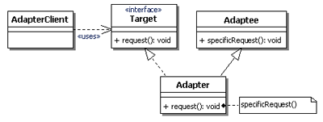
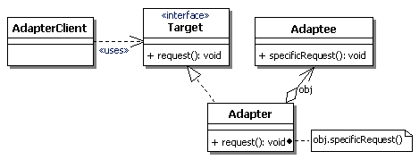

# Design Pattern là gì?
Design Pattern ban đầu đơn giản là một khái niệm kiến trúc do Christopher Alexander gây dựng. Lần đầu tiên được ứng dụng vào phần mềm vào năm 1987 bởi Kent Beck and Ward Cunningham. Hai ông trình bày ý tưởng của mình trong một hội nghị. Sau đó Design Pattern trở thành khái niệm phổ biến và tiếp tuc phát triển cho đến ngày nay. Design Pattern lần đầu tiên được tổng hợp thành cuốn sách hoàn chỉnh vào năm 1995 trong cuốn `Design Patterns: Elements of Reusable Object-Oriented Software`.
Trong phát triển phần mềm, Design Pattern là giải pháp thiết kế mã để tái sử dụng chúng. Design Pattern được sử dụng mạnh mẽ nhất trong OOP qua Object và Class. Có rất nhiều Design Pattern, theo tổng kết của Gang of Four, hiện tại có hơn 250 mẫu đang được sử dụng trong phát triển phần mềm, tuy nhiên bạn không cần sử dụng hết 250 mẫu này, một lập trình viên giỏi Desgin Pattern chỉ cần sử dụng thành thạo khoảng 35 mẫu.

*Lưu ý: Design Pattern không phải thuật toán, không phải một component.*
| Creational | Structure | Behavioral |
| --- | --- | --- |
| Singleton | Adapter/ Wrapper | Chain of responsibility |
| Factory | Bridge | Command |
| Method Factory | Composite | Interpreter |
| Abstract Factory | Decorator | Iterator |
| Builder | Facade | Mediator |
| Object Pool | Proxy | Memento |
| Prototype | Flyweight | Observer |
| | Registry | Strategy |
| | Data Mapper | Template Method |
| | Dependency Injection | Visitor |
| | Fluent Interface | Null Object |
| | Delegation | Specification |
| | | State |
| | | Repository |
| | | Entity-Attribute-Value (EAV) |

# II. Structure
## 1. Adapter/ Wrapper
>Adapter Pattern là pattern giữ vai trò trung gian giữa hai lớp, chuyển đổi giao diện của một hay nhiều lớp có sẵn thành một giao diện khác, thích hợp cho lớp đang viết. Điều này cho phép các lớp có các giao diện khác nhau có thể dễ dàng giao tiếp tốt với nhau thông qua giao diện trung gian, không cần thay đổi code của lớp có sẵn cũng như lớp đang viết. Adapter Pattern còn gọi là Wrapper Pattern do cung cấp một giao diện “bọc ngoài” tương thích cho một hệ thống có sẵn, có dữ liệu và hành vi phù hợp nhưng có giao diện không tương thích với lớp đang viết

Adapter là một khái niệm rất thông dụng trong đời sống hàng ngày. Ta thường hay bắt gặp các loại adapter như: power adapter (chuyển đổi điện áp), laptop adapter (bộ sạc của laptop) hay memory card adapter… Các adapter này có nhiệm vụ chính là làm cầu nối trung gian để giúp hai đồ vật gì đó có thể hoạt động với nhau.

### 1.1. Tại sao cần sử dụng Adapter Pattern
Có khi nào bạn cảm thấy chán nản khi phải viết đi viết lại những đoạn code giống nhau từ dự án này sang dự án khác? Bạn đi đến quyết định cần phải tự viết library để tái sử dụng, tuy nhiên sẽ có tình huống interface mà bạn viết phù hợp với dự án cũ nhưng sang dự án mới thì không dùng được. Bạn lại hì hục ngồi sửa lại thư viện của mình để phù hợp với dự án mới. Adapter Pattern chính là cứu tinh của bạn trong trường hợp này. Apdater Pattern nên được sử dụng trong trường hợp :

- Bạn muốn sử dụng một Class đã có sẵn mà interface của nó lại không tương thích với interface bạn mong muốn. Chẳng hạn bạn muốn sử dụng một library của bên thứ ba nhưng interface của nó lại không phù hợp với dự án của bạn.
- Bạn muốn tạo ra một Class có khả năng tái sử dụng cao. Class của bạn có thể tương tác với các class có interface không tương thích sau này.

Để hiểu về sơ đồ mô tả Adapter Pattern thì trước hết bạn phải hiểu về 3 khái niệm:
- **Client**: Đây là lớp sẽ sử dụng đối tượng của bạn (đối tượng mà bạn muốn chuyển đổi giao diện)
- **Adaptee**: Đây là những lớp bạn muốn lớp Client sử dụng, nhưng hiện thời giao diện của nó không phù hợp
- **Adapter**: Đây là lớp trung gian, thực hiện việc chuyển đổi giao diện cho Adaptee và kết nối Adaptee với Client

### 1.2. Phân loại adapter
- **Composition**: Cấu thành. Nghĩa là một lớp B nào đó sẽ trở thành một thành phần của lớp A (một field trong lớp A). Tuy lớp A không kế thừa lại giao diện của lớp B nhưng nó có được mọi khả năng mà lớp B có
- **Inheritance**: Kế thừa. Nghĩa là một lớp Derived sẽ kế thừa từ lớp Base và thừa hưởng tất cả những gì lớp Base có. Nhờ kế thừa mà nó giúp tăng khả năng sử dụng lại code, tăng khả năng bảo trì và nâng cấp chương trình. Và do vậy kế thừa là khái niệm trọng tâm trong hướng đối tượng. Nhưng nó có một nhược điểm, đôi khi nếu chúng ta quá lạm dụng nó, nó sẽ làm cho chương trình của chúng ta phức tạp lên nhiều, điển hình là trong lập trình game. Do vậy đôi lúc trong lập trình game người ta thường có khuynh hướng thích sử dụng composition hơn

Và ứng với hai khái niệm này sẽ cho ta hai cách để chúng ta cài đặt lớp adapter: **Object Adapter** và **Class Adapter**

### 1.3. Class Adapter
Trong mô hình này, một lớp mới (Adapter) sẽ kế thừa lớp có sẵn với giao diện không tương thích (Adaptee), đồng thời cài đặt giao diện mà người dùng mong muốn (Target). Trong lớp mới, khi cài đặt các phương thức của giao diện người dùng mong muốn, phương thức này sẽ gọi các phương thức cần thiết mà nó thừa kế được từ lớp có giao diện không tương thích.

#### 1.3.1. Cấu trúc


#### 1.3.2. Ví dụ
- Tạo giao diện Target phù hợp cho người sử dụng
```javascript
interface Target {
    request(): string;
}
```
- Tạo lớp Adaptee chứa giao diện không phù hợp
```javascript
class Adaptee {
    specificRequest() : string {
        return ".eetpadA eht fo roivaheb laicepS";
    }
}
```
- Tạo lớp Adapter chuyển đổi giao diện sao cho phù hợp với lớp Target
```javascript
class Adapter extends Adaptee implements Target {
    constructor() {
        super();
    }
    request(){
        return "Adapter: (TRANSLATED) "+this.specificRequest().split("").reverse().join("");
    }
}
```
- Client sử dụng
```javascript
function clientCode(target: Target) {
    console.log(target.request());
}
let adaptee = new Adaptee();
console.log("Client: The Adaptee class has a weird interface. See, I don't understand it");
console.log("Adaptee: "+adaptee.specificRequest());

console.log("Client: But I can work with it via the Adapter");
let adapter = new Adapter();
clientCode(adapter);
```
- Kết quả
```
Client: The Adaptee class has a weird interface. See, I don't understand it
Adaptee: .eetpadA eht fo roivaheb laicepS
Client: But I can work with it via the Adapter
Adapter: (TRANSLATED) Special behavior of the Adaptee.
```

### 1.4. Object Adapter
Đây là một phương pháp cài đặt Adapter Pattern dựa trên ý tưởng về composition. Một lớp mới (Adapter) sẽ tham chiếu đến một (hoặc nhiều) đối tượng của lớp có sẵn với giao diện không tương thích (Adaptee), đồng thời cài đặt giao diện mà người dùng mong muốn (Target). Trong lớp mới này, khi cài đặt các phương thức của giao diện người dùng mong muốn, sẽ gọi phương thức cần thiết thông qua đối tượng thuộc lớp có giao diện không tương thích. Tiếp hợp đối tượng tránh được vấn đề đa thừa kế, không có trong các ngôn ngữ hiện đại (Java, C#). Mình khuyến khích các bạn sử dụng cách này.

#### 1.4.1. Cấu trúc Object Adapter


#### 1.4.2. Ví dụ
- Tạo lớp Target (lớp ban đầu mà client sử dụng)
```javascript
class Target {
    request() {
        return "Target: The default target's behavior.";
    }
}
```
- Tạo lớp Adaptee chứa giao diện không phù hợp
```javascript
class Adaptee {
    specificRequest() {
        return ".eetpadA eht fo roivaheb laicepS";
    }
}
```
- Tạo lớp Adapter chuyển đổi giao diện sao cho phù hợp với lớp Target
```javascript
class Adapter implements Target {
    constructor(private obj: Adaptee) { }
    request(){
        return "Adapter: (TRANSLATED) "+this.obj.specificRequest().split("").reverse().join("");
    }
}
```
- Client sử dụng
```javascript
function clientCode(target: Target) {
    console.log(target.request());
}
let adaptee = new Adaptee();
console.log("Client: The Adaptee class has a weird interface. See, I don't understand it");
console.log("Adaptee: "+adaptee.specificRequest());

console.log("Client: But I can work with it via the Adapter");
let adapter = new Adapter(adaptee);
clientCode(adapter);
```
- Kết quả
```
Client: The Adaptee class has a weird interface. See, I don't understand it
Adaptee: .eetpadA eht fo roivaheb laicepS
Client: But I can work with it via the Adapter
Adapter: (TRANSLATED) Special behavior of the Adaptee.
```

### 1.5. Lời kết
Adapter Design pattern thực sự rất hữu ích khi bạn code với ứng dụng lớn có sử dụng nhiều API từ bên ngoài, nó giúp bạn giảm thiểu tối đa nhưng thay đổi từ nhà cung cấp API. Nhìn thì thực sự nó hơi phức tạp vì phải tạo ra nhiều lớp và interface khác nhau nhưng nếu hệ thống lớn thì nó lại có rất nhiều hữu ích.